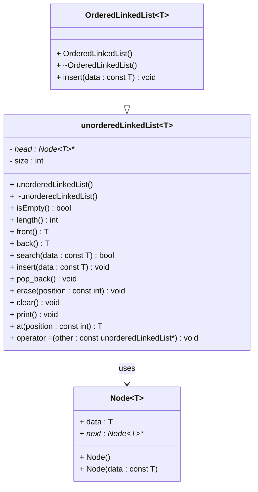

# Single Linked List

## UML Diagram

## Contributing
We welcome contributions to improve this Single Linked List implementation. To contribute:
1. Fork the repository.
2. Create a new branch (git checkout -b feature-branch).
3. Commit your changes (git commit -am 'Add new feature').
4. Push to the branch (git push origin feature-branch).
5. Create a new pull request.