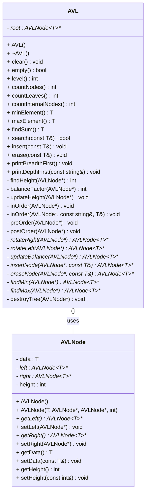

# AVL Tree

## Features
- **Insert**: Add elements to the AVL.
- **Erase**: Remove nodes from the AVL.
- **Search**: Check if an element exists in the AVL.
- **Traversal**: Supports in-order, pre-order, post-order, and breadth-first traversals.
- **Find Min/Max**: Find the smallest and largest elements in the AVL.
- **Height Calculation**: Calculate the height of the tree.
- **Counting Nodes and Leaves**: Count the number of nodes and leaves in the tree.
- **Sum of Elements**: Calculate the sum of all elements in the AVL.

## UML Diagram

## Contributing
We welcome contributions to improve this AVL Tree implementation. To contribute:
1. Fork the repository.
2. Create a new branch (git checkout -b feature-branch).
3. Commit your changes (git commit -am 'Add new feature').
4. Push to the branch (git push origin feature-branch).
5. Create a new pull request.